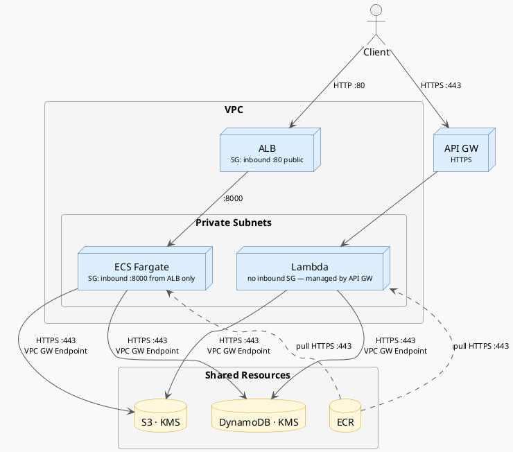
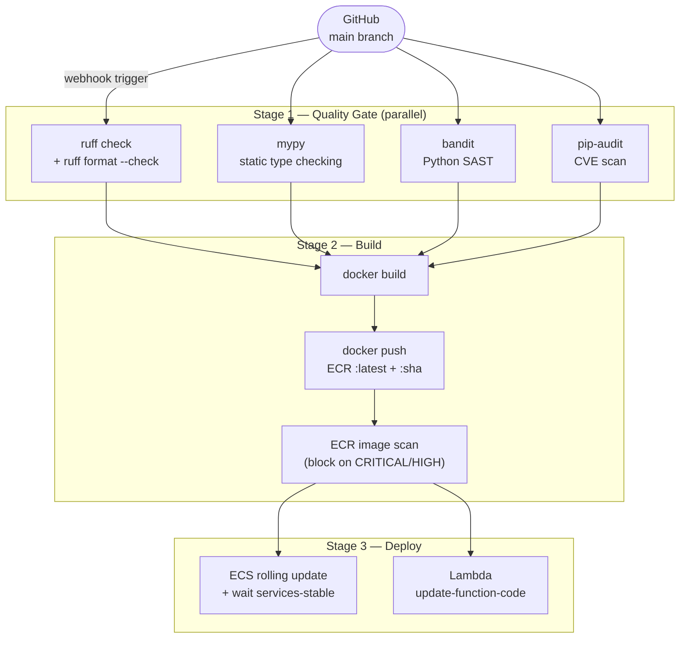

# FastAPI File Storage — AWS Infrastructure

A FastAPI application deployed on AWS using two compute strategies — containerized (ECS Fargate) and serverless (Lambda + API Gateway) — backed by S3 for file storage and DynamoDB for authentication, fully managed with AWS CDK in TypeScript.

---

## Architecture Overview



Both targets run the **same Docker image**. ECS runs it with `uvicorn` (overridden via the task definition `command`). Lambda runs it with `awslambdaric` as the entrypoint and `main.handler` (Mangum) as the handler.

---

## Repository Structure

```
.
├── app/
│   ├── main.py            # FastAPI route definitions + Mangum handler
│   ├── auth.py            # HTTP Basic Auth — DynamoDB lookup + bcrypt verify
│   ├── storage.py         # S3 operations — upload, list (paginated), delete
│   ├── Dockerfile         # Multi-stage, dual-mode (ECS + Lambda, same image)
│   └── requirements.txt
├── cdk/
│   ├── bin/app.ts         # CDK entrypoint — stacks in dependency order
│   └── lib/
│       ├── constants.ts   # PROJECT_PREFIX shared by all stacks
│       ├── app/
│       │   ├── ecs-api.ts         # ECS compute target (roles, log group, Fargate)
│       │   ├── lambda-api.ts      # Lambda compute target (roles, log group, API GW)
│       │   ├── file-storage.ts    # S3 + DynamoDB + KMS keys aggregate
│       │   └── storage-grants.ts  # Shared IAM grant helper for both targets
│       ├── constructs/
│       │   ├── compute/
│       │   │   ├── ecr-repository.ts  # ECR repo with image scan + lifecycle
│       │   │   ├── ecs-fargate.ts     # Cluster + task def + service + ALB wiring
│       │   │   └── lambda-function.ts # DockerImageFunction, VPC-aware
│       │   ├── network/
│       │   │   ├── vpc.ts             # VPC — 2 AZs, public + private subnets
│       │   │   └── alb.ts             # Internet-facing ALB, HTTP listener
│       │   ├── observability/
│       │   │   └── log-group.ts       # CloudWatch log group with KMS encryption
│       │   ├── pipeline/
│       │   │   └── codepipeline.ts
│       │   └── security/
│       │       ├── iam-role.ts        # Role with explicit principal + description
│       │       ├── kms-key.ts         # Key with rotation + IAM delegation policy
│       │       └── s3-bucket.ts       # Private, SSL-enforced, KMS-encrypted bucket
│       └── stacks/
│           ├── shared-stack.ts    # S3, ECR, DynamoDB — writes ARNs to SSM
│           ├── network-stack.ts   # VPC, ALB — writes IDs to SSM
│           ├── ecs-stack.ts       # ECS Fargate compute target
│           ├── lambda-stack.ts    # Lambda + API Gateway compute target
│           └── pipeline-stack.ts  # CodePipeline CI/CD — 3 stages
├── tests/
│   ├── fixtures/
│   │   ├── hello.txt      # Plain text test fixture
│   │   └── data.csv       # CSV test fixture
│   └── test-api.sh        # End-to-end smoke test script
├── .env.example           # Reference for required environment variables
├── RUNBOOK.md             # Step-by-step deployment guide
└── CLAUDE.md              # Coding guidelines for this project
```

---

## CDK Stack Organization

Cross-stack references use **SSM Parameter Store** — never `Fn.importValue`. CloudFormation exports block stack updates when a dependent stack exists; SSM decouples stacks entirely so each can be deployed independently.

Stacks are thin: they instantiate constructs and write SSM parameters. All logic lives in constructs.

### Deployment order

```
SharedStack → NetworkStack → EcsStack → LambdaStack → PipelineStack
```

### SharedStack
Durable shared resources. Writes ARNs and names to SSM.
- S3 bucket — KMS-encrypted, public access blocked, SSL enforced, lifecycle policy (Glacier after 90d, delete after 365d)
- ECR repository — image scan on push, lifecycle rule (retain last 10)
- DynamoDB `users` table — KMS-encrypted, on-demand billing
- KMS keys — separate keys for S3 and DynamoDB, annual rotation, IAM delegation policy

### NetworkStack
- VPC — 2 AZs, public + private subnets, Gateway Endpoints for S3 and DynamoDB
- ALB — internet-facing, HTTP listener (HTTPS would require an ACM certificate + domain)

### EcsStack
- ECS Cluster + Fargate service in private subnets
- Task role — scoped S3 + DynamoDB + KMS grants via `grantStorageAccess`
- Execution role — `AmazonECSTaskExecutionRolePolicy` (ECR pull + CloudWatch write)
- Container InsightsV2 enabled

### LambdaStack
- Lambda `DockerImageFunction` — same ECR image as ECS, 512 MB, 29s timeout (API Gateway hard limit)
- Runs in private subnets — traffic to S3 + DynamoDB routes through VPC Gateway Endpoints (no NAT cost)
- API Gateway HTTP API — `$default` route, native HTTPS endpoint
- Execution role — `AWSLambdaBasicExecutionRole` + `AWSLambdaVPCAccessExecutionRole` + scoped storage grants

### PipelineStack
Three-stage CodePipeline (V2 — webhook-based trigger):
1. **Source** — GitHub via CodeConnections
2. **Quality Gate** — lint (`ruff`), format, type check (`mypy`), SAST (`bandit`), dependency CVE scan (`pip-audit`) — all run in parallel
3. **Deploy** — ECS rolling update (waits for stability) + Lambda `update-function-code`

---

## IAM Design

No wildcard actions. No wildcard resources. All grants go through `grantStorageAccess` (shared helper in `storage-grants.ts`) which is the single source of truth for both compute targets.

| Role | Principal | Actions | Scope |
|---|---|---|---|
| ECS Task Role | `ecs-tasks.amazonaws.com` | `s3:PutObject`, `s3:GetObject`, `s3:DeleteObject`, `s3:ListBucket` | Project bucket only |
| ECS Task Role | `ecs-tasks.amazonaws.com` | `dynamodb:GetItem` | Users table only |
| ECS Execution Role | `ecs-tasks.amazonaws.com` | ECR pull + CloudWatch Logs write | Scoped to project ECR + log group |
| Lambda Execution Role | `lambda.amazonaws.com` | Same S3 + DynamoDB as ECS | Same scopes |
| Lambda Execution Role | `lambda.amazonaws.com` | ENI management (VPC) | Via `AWSLambdaVPCAccessExecutionRole` |
| CodeBuild Deploy | CodeBuild service | `ecs:UpdateService`, `ecs:DescribeServices` | Specific cluster/service ARN |
| CodeBuild Deploy | CodeBuild service | `lambda:UpdateFunctionCode` | Specific function ARN |

---

## Authentication

HTTP Basic Auth on every endpoint except `/health`.

On each request, FastAPI reads the `Authorization` header, fetches the user from DynamoDB by username, and verifies the password against the stored bcrypt hash. Passwords are never stored or compared as plain text.

**Timing-safe:** `bcrypt.checkpw` is always called, even when the username doesn't exist. A module-level `_DUMMY_HASH` is used as the comparison target to prevent timing-based username enumeration.

**DynamoDB `users` table schema:**

| Attribute | Type | Description |
|---|---|---|
| `username` | String (PK) | Unique username |
| `password_hash` | String | bcrypt hash |
| `created_at` | String | ISO 8601 timestamp |

---

## API Endpoints

| Method | Path | Auth | Description |
|---|---|---|---|
| `GET` | `/health` | None | Liveness probe — returns `{"status": "healthy"}` |
| `POST` | `/upload` | Basic Auth | Uploads a file to `files/{username}/{filename}` |
| `GET` | `/files` | Basic Auth | Lists files for the authenticated user |
| `DELETE` | `/files/{filename}` | Basic Auth | Deletes a file belonging to the authenticated user |

Files are namespaced per user: `files/{username}/{filename}`. Filenames are validated against `[A-Za-z0-9._-]+` — ASCII only, preventing path traversal and Unicode-related S3 key issues. Upload size is capped at 10 MB.

**Lambda endpoint:** `https://g4zeui4e9b.execute-api.us-east-1.amazonaws.com`

---

## Technology Choices

### Why S3 for file storage?
Files are arbitrary binary blobs of unknown size — S3 is the natural fit. The alternatives considered:
- **EFS** — works, but requires a mount target in every subnet, adds ~$0.30/GB/month, and is overkill for a stateless HTTP API.
- **Storing files in DynamoDB** — DynamoDB items are capped at 400 KB. Storing binary content in a database is the wrong abstraction regardless.
- **RDS / blob columns** — adds a managed DB instance (~$15/month minimum), connection pooling complexity, and no durability advantage over S3.

S3 gives unlimited storage, built-in durability (11 nines), per-object lifecycle management (Glacier after 90 days, delete after 365), and SDK support in every Lambda/ECS runtime — with zero infrastructure to manage.

### Which serverless alternatives were explored?

**Compute options:**

| Option | Why not chosen |
|---|---|
| **AWS Lambda** ✅ | Chosen — scales to zero, per-invocation billing, native container image support |
| **App Runner** | Managed container runtime, but minimum ~$5/month even at zero traffic. No scale-to-zero. |
| **Fargate Spot / scheduled** | Still requires a cluster and a minimum running task — not truly serverless |
| **API Gateway + Lambda (ZIP)** | Would require a separate build artifact; the container image approach reuses the exact same image as ECS |

**Routing / trigger options:**

| Option | Why not chosen |
|---|---|
| **API Gateway HTTP API** ✅ | Chosen — lowest latency and cost of the API GW tiers, native HTTPS, supports JWT/IAM authorizers if needed later |
| **API Gateway REST API** | ~3.5× more expensive, adds request/response mapping overhead, features not needed here |
| **Lambda Function URL** | Simplest option, but no throttling, no WAF integration, no stage management |
| **ALB → Lambda** | Would expose Lambda behind the same ALB as ECS, coupling two independent compute targets to a shared network resource |

HTTP API was the right balance: it provides a proper managed HTTPS endpoint with built-in throttling and a clean ARN, without the cost and complexity of REST API.

### Why FastAPI?
Async-first, automatic OpenAPI docs, native type hints with Pydantic validation. Minimal boilerplate for a REST API of this size.

### Why the same image for ECS and Lambda?
Build once, deploy twice. The Dockerfile uses a multi-stage build and is dual-mode:
- **Lambda:** `ENTRYPOINT ["python", "-m", "awslambdaric"]` + `CMD ["main.handler"]` — the Lambda Runtime Interface Client bootstraps the execution environment.
- **ECS:** task definition overrides both `ENTRYPOINT` to `["uvicorn"]` and `CMD` to `["main:app", "--host", "0.0.0.0", "--port", "8000"]`.

`mangum` wraps the FastAPI ASGI app and translates Lambda event payloads to ASGI scope/receive/send.

### Why API Gateway HTTP API over Function URL?
Function URLs are fine for single-function endpoints but offer no routing, throttling, or stage management. HTTP API is the lightweight API Gateway tier — lower cost and latency than REST API, with a proper managed HTTPS endpoint.

### Why Lambda in a VPC?
S3 and DynamoDB traffic stays inside the AWS network via VPC Gateway Endpoints — no Internet Gateway, no NAT Gateway cost. The VPC also provides network isolation consistent with the ECS target.

### Why DynamoDB over RDS?
- RDS minimum cost (~$15/month for `db.t3.micro`) requires a subnet group and adds connection management complexity.
- DynamoDB is serverless, zero-config from both ECS and Lambda, and free at this scale (on-demand, 25 GB + 200M requests/month free tier).
- A single `GetItem` per request — DynamoDB is the right shape for this workload.

### Why SSM Parameter Store for cross-stack references?
`Fn.importValue` (CloudFormation exports) blocks stack updates when another stack consumes an export. SSM is read at deploy time, not synth time (except `valueFromLookup` for VPC ID), and allows independent stack deployments.

### Why CDK Constructs (L3) over raw CloudFormation?
Constructs bundle a resource with its security defaults, lifecycle config, and grant methods in one class — the equivalent of a Terraform module. Stacks stay thin and readable. The abstraction also prevents inconsistent security settings (e.g., forgetting `enforceSSL` on a bucket).

---

## Problems Encountered

### Dual-mode container (ECS + Lambda from the same image)
**Problem:** The initial Dockerfile used `CMD ["uvicorn", ...]` as the default entrypoint. When the same image was deployed to Lambda, it started uvicorn instead of the Lambda Runtime Interface Client, causing Lambda to fail with "Service Unavailable" on every invocation.

**Solution:** Flipped the default to Lambda mode: `ENTRYPOINT ["python", "-m", "awslambdaric"]` + `CMD ["main.handler"]`. ECS overrides both `ENTRYPOINT` and `CMD` in the task definition — overriding only `CMD` leaves `awslambdaric` as the entrypoint, which crashes on ECS because `AWS_LAMBDA_RUNTIME_API` is not set. This is the correct pattern for non-Lambda base images (no `FROM public.ecr.aws/lambda/python` needed).

### `fromRepositoryArn` with SSM late-bound tokens
**Problem:** `ecr.Repository.fromRepositoryArn(scope, id, arn)` calls `.split('/')` on the ARN at synth time to derive the repository name. When the ARN is a late-bound SSM token (`resolve:ssm:...`), the split returns the token string itself, causing CDK to generate an invalid repository name and a CloudFormation error at deploy time.

**Solution:** Store `repositoryName` separately in SSM (done in `SharedStack`) and use `Repository.fromRepositoryAttributes(scope, id, { repositoryArn, repositoryName })` which accepts both values independently.

### `AWS_REGION` reserved environment variable
**Problem:** Setting `AWS_REGION` as an explicit environment variable on a Lambda function causes a CloudFormation error: `Lambda was unable to configure your environment variables because the environment variables you have provided contains reserved keys`.

**Solution:** Lambda injects `AWS_REGION` automatically. It must never be set manually in the function's environment. Documented in `CLAUDE.md` as a project rule.

### Timing oracle in authentication
**Problem:** The original auth code returned early if the username was not found in DynamoDB, without calling `bcrypt.checkpw`. An attacker could measure response times to enumerate valid usernames (valid usernames take longer because bcrypt runs; invalid ones return immediately).

**Solution:** `bcrypt.checkpw` is always called. A module-level `_DUMMY_HASH` is used as the stored hash when the user doesn't exist. Both code paths take the same amount of time.

### Unicode in filename regex
**Problem:** The original filename validation used `\w` which matches Unicode letters, digits, and underscores. Unicode characters in S3 keys cause unpredictable percent-encoding behaviour across SDKs and can be used for path confusion attacks.

**Solution:** Replaced `\w` with the explicit ASCII character class `[A-Za-z0-9._-]`. Predictable, portable, and sufficient for all legitimate filenames.

### S3 `list_objects_v2` pagination
**Problem:** `list_objects_v2` returns at most 1000 objects per call. The original `list_files` returned a truncated list silently when a user had more than 1000 files.

**Solution:** Loop with `NextContinuationToken` until `IsTruncated` is false, accumulating all keys before returning.

---

## Local Development

Copy `.env.example` to `.env` and fill in the values for your target environment:

```bash
cp .env.example .env
```

| Variable | Description |
|---|---|
| `AWS_REGION` | AWS region (e.g. `us-east-1`) |
| `APP_VERSION` | Injected by CI/CD — use `local` for local runs |
| `S3_BUCKET_NAME` | S3 bucket name (from SSM `/file-api/bucket-name`) |
| `DYNAMO_TABLE_NAME` | DynamoDB table name (from SSM `/file-api/dynamo-table-name`) |

AWS credentials are never stored in `.env`. Use an AWS CLI profile:

```bash
aws configure --profile stratocore-dev
```

---

## Deployment

See [RUNBOOK.md](RUNBOOK.md) for the full step-by-step guide (bootstrap, Docker build, stack order, user creation, smoke test, teardown).

### Stack deployment order

```
file-api-shared → file-api-network → file-api-ecs → file-api-lambda → file-api-pipeline
```

After the first deploy, every push to `main` triggers the pipeline automatically — no manual `cdk deploy` needed.

### NetworkStack
Reads from SSM. Creates:
- **VPC** — two Availability Zones, public and private subnets
- **Security Groups** — ALB accepts inbound 443 only; ECS tasks accept inbound from ALB only
- **Application Load Balancer** — internet-facing, HTTP → HTTPS redirect, forwards to ECS target group
- Writes to SSM: `vpc-id`, `alb-arn`, `private-subnet-ids`, `ecs-sg-id`

### EcsStack
Reads from SSM. Creates:
- **ECS Cluster** — Fargate launch type
- **Task Definition** — FastAPI container, `awslogs` driver → CloudWatch
- **ECS Service** — private subnets, registered to ALB target group
- **Task Role** — S3 + DynamoDB permissions via construct grant methods
- **Execution Role** — ECR pull + CloudWatch Logs write

### LambdaStack
Reads from SSM. Creates:
- **Lambda Function** — Python runtime, FastAPI wrapped with Mangum
- **Function URL** — HTTPS, CORS configured
- **Execution Role** — same S3 + DynamoDB permissions as ECS task role

---

## IAM Design

No wildcard actions. No wildcard resources. All grants go through construct methods.

| Role | Principal | Allowed Actions | Scope |
|---|---|---|---|
| ECS Task Role | `ecs-tasks.amazonaws.com` | `s3:PutObject`, `s3:GetObject`, `s3:DeleteObject`, `s3:ListBucket` | Project bucket only |
| ECS Task Role | `ecs-tasks.amazonaws.com` | `dynamodb:GetItem` | Users table only |
| ECS Execution Role | `ecs-tasks.amazonaws.com` | `ecr:GetAuthorizationToken`, `ecr:BatchGetImage`, `logs:CreateLogStream`, `logs:PutLogEvents` | ECR + CloudWatch scoped |
| Lambda Execution Role | `lambda.amazonaws.com` | `s3:PutObject`, `s3:GetObject`, `s3:DeleteObject`, `s3:ListBucket` | Project bucket only |
| Lambda Execution Role | `lambda.amazonaws.com` | `dynamodb:GetItem` | Users table only |

---

## Authentication

**HTTP Basic Auth** on every endpoint except `/health`.

On each request FastAPI reads the `Authorization` header, fetches the user record from DynamoDB by `username`, and verifies the submitted password against the stored bcrypt hash. Passwords are never stored or compared in plain text.

**DynamoDB `users` table schema:**

| Attribute | Type | Description |
|---|---|---|
| `username` | String (PK) | Unique username |
| `password_hash` | String | bcrypt hash |
| `created_at` | String | ISO 8601 timestamp |

Files are namespaced per user: `files/{username}/{filename}`. A user can only access their own files — enforced at the application level.

---

## API Endpoints

| Method | Path | Auth | Description |
|---|---|---|---|
| `GET` | `/health` | None | Returns `{"status": "healthy"}` |
| `POST` | `/upload` | Basic Auth | Uploads a file to `files/{username}/{filename}` |
| `GET` | `/files` | Basic Auth | Lists files for the authenticated user |
| `DELETE` | `/files/{filename}` | Basic Auth | Deletes a file belonging to the authenticated user |

> **Lambda payload limit:** 6 MB per request. Files larger than 6 MB must go through the ECS/ALB endpoint.

---

## File Persistence

Files are stored in S3 at `files/{username}/{filename}`. S3 is the single source of truth for both compute targets — restarting or redeploying ECS or Lambda has no impact on stored files.

**Lifecycle policy:**
- Transition to S3 Glacier Instant Retrieval after **90 days**
- Permanent deletion after **365 days**
- Incomplete multipart uploads aborted after **7 days**

---

## CI/CD Pipeline

Three stages. A failure at any stage blocks everything downstream.



### Quality tools

| Tool | Category | What it catches |
|---|---|---|
| `ruff check` | Lint | PEP8 violations, unused imports |
| `ruff format --check` | Format | Inconsistent formatting |
| `mypy` | Type checking | Type mismatches, missing annotations |
| `bandit` | SAST | Hardcoded secrets, unsafe calls |
| `pip-audit` | Dependency scan | Known CVEs in requirements.txt |
| SonarCloud | SAST + quality | Code smells, duplications, security hotspots |
| ECR basic scan | Image scan | OS and package CVEs in the Docker image |

---

## Design Decisions

### Why S3 for file persistence?
ECS Fargate tasks are ephemeral — the local filesystem is lost on every restart or redeployment. S3 provides durable object storage accessible identically from ECS and Lambda through IAM roles, with no network configuration required.

### Why DynamoDB for authentication?
- RDS costs ~$15/month minimum for `db.t3.micro`, requires a VPC subnet group, and forces Lambda into the VPC (longer cold starts, ENI management).
- A sidecar database container in ECS requires EFS for persistence and is unreachable from Lambda without extra networking.
- DynamoDB is serverless, zero network config, free at this scale (on-demand, 25 GB + 200M requests/month free tier), and works identically from ECS and Lambda.

### Why SSM Parameter Store for cross-stack references?
`Fn.importValue` (CloudFormation exports) blocks stack updates when another stack depends on an export. SSM decouples stacks entirely — each reads what it needs at synth time and can be deployed independently.

### Why Lambda Function URL instead of API Gateway?
API Gateway adds stage management, integration mapping, and request transformation with no benefit at this scale. A Function URL is a direct HTTPS endpoint with zero additional infrastructure. The trade-off (no built-in rate limiting) is acceptable for this use case.

### Why ECS Fargate instead of EC2?
Fargate removes OS patching and instance sizing. For a stateless API container, pay-per-task is the correct model.

### Why CDK Constructs (L3)?
Constructs encapsulate a resource with its security defaults, lifecycle config, and grant methods in one reusable, testable class — the equivalent of a Terraform module. Stacks stay thin and readable, all logic lives in constructs, and jest unit tests validate the generated CloudFormation without deploying anything.
